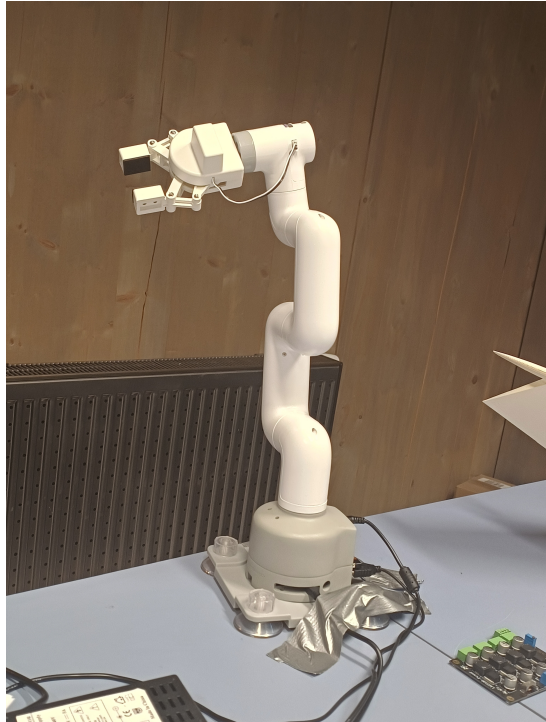
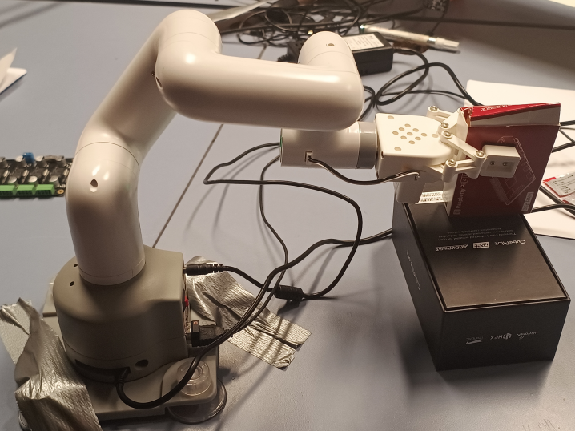
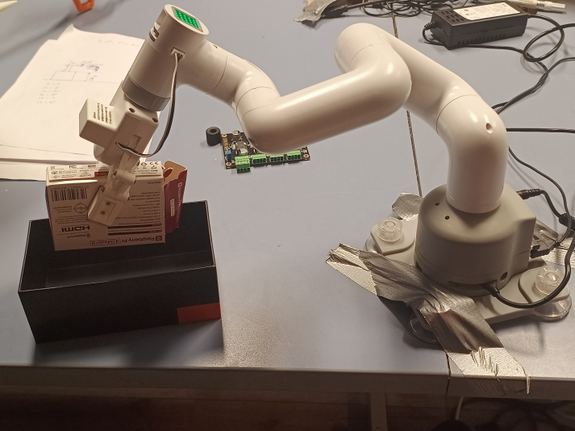

# Control_myCobot_6DOF_Robot_Arm
This project presents the keyboard buttons control of a 6-degree-of-freedom MYCobot robotic arm, showcasing its advanced intelligent route planning capabilities. The project aim involves showcasing the arm’s autonomous control through specific poses triggered by dedicated keyboard buttons. Operationalizing these commands, the robotic arm seamlessly executes movements, autonomously navigating to reach the predetermined poses. Each button corresponds to a unique pose, prompting immediate movement upon activation. Furthermore, leveraging RVIZ2 facilitates the integration of the myCobot GUI interface, streamlining the configuration of individual poses programmed through these buttons.

# Components needed 
1. MyCobot robotic arm
2. Desktop computer, Keyboard, HDMI cable.
3. Visual Studio Code (VS Code)

# Specifications of Mycobot Robot Arm
6 DOF   
280 Working Radius（mm） 
250 Payload（g） 
860 Weight（g） 
± 0.5 Positioning Accuracy（mm） 
500 Working Lifespan（h）	 
12V5A Power Input	DC  
USB	USB 3.0*2USB 2.0*2 
Main control type	Raspberry pi 
Master control CPU	Broadcom BCM2711，64Bit 1.5GHz four-core 
Master control GPU	500 MHz VideoCore VI 
Master control Memory	2GB 

# Installation and Setup
The myCobot is connected to the power supply which turns on the robot arm. HDMI, Mouse, and keyboard cables connect to the robot arm which enables the robot setup process to be seamless. A built-in Ubuntu 18.04 Mate Linux imager is installed into the robot raspberry pi which serves as the desktop operating system for the myCobot 280pi robot arm. Setup, updates and all ROS2 packages installation is perform. The installing time for setting up the robot is approximately 8 hours long.

**Installing git**
1. sudo apt install git
   **confirming the git version installed**
2. git --version
   **use for installing pip**
3. sudo apt install python-pip

**Next, create the workspace and install the myCobot package** 
**Created a folder** 
mkdir -p ˜/colcon_ws/src 
**Enter the folder**
cd ˜/colcon_ws/src 
**use git clone, to get the myCobot**
package which will be edit to the code implemented in this project 
git clone https://github.com/elephantrobotics/mycobot_ros2.git 
**move back to workspace** 
cd .. 
**Build the project workspace** 
colcon build --symlink-install 

**source the project work environment** 
source install/setup.bash 

**Install the pymcobot**
pip install pymycobot  

# Extract each Joint Angles 
Following the preliminary stage, prior to programming the launch file for interfacing with the robot, a graphical user interface (GUI) for getting the robot arm joints angles is employed. This GUI facilitates the extraction of essential joint angles crucial for implementing intelligent route planning within the robot arm system. Activation of the myCobot joint GUI involves utilizing a ROS2 terminal and a specific snippet code embedded within a launch file. Through this interface, three distinct poses, namely the home, pick, and place poses, are meticulously configured, contributing to the comprehensive setup of the robotic arm’s operational parameters.

The initial pose corresponds to the robot’s home position, where all joint angles are uniformly set to zero. In this configuration, the robot arm’s links align vertically, forming the pose (0,0,0,0,0,0). Following this, the pick pose is established, characterized by joint angles (0, 30, 60, 80, 0, 45). Lastly, the place pose is defined, featuring joint angles (0,-45, -45, 60, 0, 45).  
**Command line use to launch GUI**  
ros2 run mycobot_280pisimple_gui.launch.py 

# Python Scripting Programming
The set of Python code adjustments integrated into the myCobot’s keyboard launch enables the control system to harmonize effortlessly with the project’s predefined goals and operational criteria. These customized modifications guarantee that the keyboard launch adeptly coordinates the myCobot’s activities, precisely adhering to the project’s unique
prerequisites and objectives. 

speed= 50 %set robot speed to 50  
% set the poses values with sped 
hom_pose=[[0, 0, 0, 0, 0, 0],sped] 
pick_pose=[[0, 30, 60, 80, 0,45],sped] 
place_pose=[[0, 0, 0, 0, 0, 0],sped]  

% create the function for controlling each pose. 
elif key in "5": 
    pc.send_angles(*pick_pose) 
elif key in "6": 
    pc.send_angles(*place_pose) 
elif key in "7": 
    pc.send_angles(*hom_pose) 

**A summary of its key componets and functionality of the python script:** 
Imports: 
print_function from __future__ for compatibility with Python 2 and 3. 
MyCobot class from pymycobot.mycobot. 
Modules sys, termios, tty, and time for terminal I/O and timing functions. 

Utility Function: 
vels(sped, turn): Formats and returns the speed and change percentage as a string. 

Raw Class: 
A context manager for setting the terminal to raw mode, allowing for real-time keyboard input handling. 

mycobot_pose_control Function: 
Initializes a MyCobot object with specific communication parameters. 
Sets initial speed and change percentage values. 
Defines three poses: hom_pose, pick_pose, and place_pose, each with associated angles and speed. 
Sends the robot to the home pose and waits for confirmation. 

Enters a loop to monitor keyboard inputs: 
k to release all servos and exit. 
5 to move to the pick pose. 
6 to move to the place pose. 
7 to return to the home pose. 
3 to update the home pose with current angles. 
Handles exceptions to ensure the loop continues running smoothly. 

main Function: 
Calls the mycobot_pose_control function. 

Script Entry Point: 
Ensures the main function runs when the script is executed directly. 

# Result
The Python script program is seamlessly integrated into the myCobot package, enhancing its functionality to trigger designated poses upon the precise button press. This integration ensures that each predefined pose is activated accordingly, allowing for streamlined execution and control of the myCobot’s movements through the keyboard interface. 

**Command line for executing the launching Pyhon script:**  
ros2 run mycobot_280piteleop_keyboard  

**Home Pose:**  
Upon the initial execution of the launch file, all joint angles reset to zero. The robot autonomously navigates to the home position from any random initial pose. Alternatively, when the robot arm is at either the ’pick’ or ’place’ poses, pressing the ’7’ key on the keyboard will promptly return all joint angles to the home pose. 

**Pick Pose:**  
The ’Pick’ pose maneuvers the robot arm into a position suitable for object grasping. When the robot arm is currently at either the ’Home’ or ’Place’ poses, pressing the ’5’ key on the keyboard will instantly adjust all joint angles to align with the ’Pick’ pose. 

**Place Pose:**  
The ’Place’ pose positions the robot arm to deposit an object at a specified location. When the robot arm is in the ’Pick’ pose, pressing the ’6’ key on the keyboard prompts autonomous movement to transition from the ’Pick’ pose to the ’Place’ pose. This action readjusts all joint angles to align with the ’Place’ pose.

# FUTURE WORKS
Incorporating a feedback loop into the setup stands as an essential step, vital for expanding the spectrum of applications for the robot. Furthermore, a significant advancement involves the adoption of a digital twin model for the mycobot. This transition entails replacing the conventional keyboard interface with a more intuitive and user-friendly control system, ultimately amplifying the robot arm’s interactivity and usability. Achieving this involves simulating the mycobot within Gazebo and RVIZ, harnessing the potential of ROS packages to facilitate real-time control and seamless synchronization between the digital twin and the physical robot. Additionally, further enhancements to
bolster autonomous control encompass integrating a camera endowed with artificial intelligence (AI) capabilities. This innovative addition empowers the robot arm to not only recognize but also proficiently grasp and place objects, significantly augmenting its functionalities.
